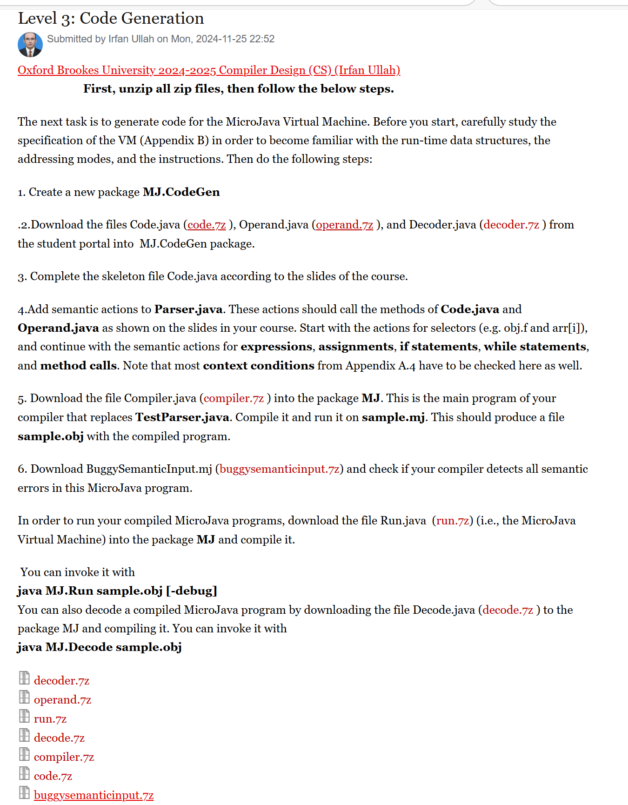

# Oxford Brookes University 2024-2025 Compiler Design —— microJava

## For tutoring, please add WeChat: lambda2024

### Project/Level 1 - Part 1: Scanning
Submitted by Irfan Ullah on Mon, 2024 - 10 - 14 23:31
Oxford Brookes University 2024 - 2025 Compiler Design (CS) (Irfan Ullah)

Hint: First, unzipped all zip files, then follow the below steps.

In this part of the project, you will implement a scanner for MicroJava. Start with the implementation of the scanner and do the following steps:
1. Study the specifications of MicroJava carefully (Appendix A.pdf download from the student portal). What are the tokens of the MicroJava grammar? What is the syntax of identifiers, numbers, character constants, and comments? What keywords and predeclared names do you need? study careful.
2. The first step is to create a package MJ and download the files Scanner.java (Scanner.zip) and Token.java (Token.zip) from into this MJ package. Look at those files and try to understand what they do.
3. Complete the skeleton file Scanner.java according to the slides of the course, we have discussed in the class, check again if you have any confusion, and compile Token.java and Scanner.java.
4. Download the file TestScanner.java (TestScanner.zip) into the package MJ and compile it.
5. Download the MicroJava program sample.mj (sample.zip) and run TestScanner on it.
6. Download the MicroJava program BuggyScannerInput.mj (BuggyScannerInput.zip) and run TestScanner on it in order to check if incorrect tokens are handled properly.

If time permits, at the end of the class, a short quiz will be administered to assess comprehension of key concepts, that you have studied during the course content of this week.

appendix.pdf
buggyscanerinput.zip
handout.pdf
microgjavamjquick-reference.pdf
sample.zip
scanner.zip
testscanner.zip
token.zip

### Project/Level 1 - Part 2: Parsing
Submitted by Irfan Ullah on Mon, 2024 - 10 - 21 21:53
Oxford Brookes University 2024 - 2025 Compiler Design (CS) (Irfan Ullah)

Hint: First, unzipped all zip files, then follow the below steps.

Part 2: Next, you should write a recursive descent parser that uses your scanner to read and check the input tokens.

Do the following steps given below:
1. Download the file Parser.java (Parser.zip) into the package MJ and check and observe what it does.
2. Complete the skeleton file Parser.java according to the slides of the course, check slides again if you have any confusion. Write a recursive descent parsing method for every production of the MicroJava grammar (see Appendix A appendix.pdf).
3. Compile Parser.java.
4. Download the file TestParser.java (TestParser.zip), compile it, and run it on sample.mj (sample.zip). If your parser is correct no errors should be reported.
5. Extend Parser.java with an error recovery according to the slides of the course. Add synchronisation points at the beginning of statements and declarations.
6. Download the MicroJava program BuggyParserInput.mj (buggyparserinput.zip) and run TestParser (TestParser.zip) on it in order to check if syntax errors are handled correctly.

buggyparserinput.zip
level-part2-parsinghandout.pdf
parser.zip
testparser.zip

### Project/Level 2: Semantic Processing
Submitted by Irfan Ullah on [No specific date]
Oxford Brookes University 2024 - 2025 Compiler Design (CS) (Irfan Ullah)

Hint: First, unzip all zip files, then follow the below steps.

Extend your parser with semantic processing. At every declaration the declared name must be entered into the symbol table. When a name occurs in a statement it must be looked up in the symbol table and the necessary context conditions must be checked (see Appendix A). Do the following steps:
1. Create a new package MJ.SymTab (i.e. a package SymTab within the package MJ).
2. Download the files Obj.java (obj.zip), Struct.java (struct.zip), Scope.java (scope.zip), and Tab.java (tab.zip) into this package and see what they do.
3. Complete the skeleton file Tab.java (i.e. the symbol table) according to the slides of the course.
4. Add semantic actions to Parser.java. These actions should enter every MicroJava name into the symbol table when it is declared and should retrieve it from the symbol table when it is used. The semantic actions should also open and close scopes appropriately. Try to check also some context conditions from (Appendix A.4, section A.4) (most context conditions can only be checked during code generation).
5. Compile everything and run TestParser.java on sample.mj again to see if it works. Insert some semantic errors into sample.mj. For example, use a few names without declaring them or declare some names twice and see if your compiler detects those errors.
6. In order to check whether you built the symbol table correctly you can call Tab.dumpScope whenever you have processed all declarations of a scope in your MicroJava program.

Additional Helping Hints: Download and complete Tab.java
- Call Tab.init() at the beginning of parsing.
- Call Tab.openScope() and Tab.closeScope() for the program, for methods and for classes.
- Return a Struct node in Type (note that it can be an array type).

Enter names into the symbol table at every declaration
- constant declaration (set also the constant value)
- variable declaration (works also for fields)
- class declaration
- method declaration
- parameter declaration

Look up a name in the symbol table wherever it occurs in a program
- in Designator
- in Type
- in object creation (new ident)

obj.zip
scope.zip
struct.zip
tab.zip

### Project/Level 3: Code Generation
Submitted by Irfan Ullah on Mon, 2024 - 11 - 25 22:52
Oxford Brookes University 2024 - 2025 Compiler Design (CS) (Irfan Ullah)

First, unzip all zip files, then follow the below steps.

The next task is to generate code for the MicroJava Virtual Machine. Before you start, carefully study the specification of the VM (Appendix B) in order to become familiar with the run-time data structures, the addressing modes, and the instructions. Then do the following steps:
1. Create a new package MJ.CodeGen.
2. Download the files Code.java (code.zip), Operand.java (operand.zip), and Decoder.java (decoder.7z) from the student portal into MJ.CodeGen package.
3. Complete the skeleton file Code.java according to the slides of the course.
4. Add semantic actions to Parser.java. These actions should call the methods of Code.java and Operand.java as shown on the slides in your course. Start with the actions for selectors (e.g. obj. and arr[]), and continue with the semantic actions for expressions, assignments, if statements, while statements, and method calls. Note that most context conditions from Appendix A.4 have to be checked here as well.
5. Download the file Compiler.java (compiler.7z) into the package MJ. This is the main program of your compiler that replaces TestParser.java. Compile it and run it on sample.mj. This should produce a file sample.obj with the compiled program.
6. Download BuggySemanticInput.mj (buggysemanticinput.7z) and check if your compiler detects all semantic errors in this MicroJava program.

In order to run your compiled MicroJava programs, download the file Run.java (run.7z) (i.e., the MicroJava Virtual Machine) into the package MJ and compile it.

You can invoke it with
java MJ.Run sample.obj [-debug]

You can also decode a compiled MicroJava program by downloading the file Decode.java (decode.7z) to the package MJ and compiling it. You can invoke it with
java MJ.Decode sample.obj

decoder.7z
operand.7z
run.7z
decode.7z
compiler.7z
code.7z
buggysemanticinput.7z

### Project/Level 4: The Compiler Generator Coco/R
Submitted by Irfan Ullah on Mon, 2024 - 12 - 02 23:32
Oxford Brookes University 2024 - 2025 Compiler Design (CS) (Irfan Ullah)

First, unzip all zip files, then follow the below steps.

Coco.jar (coco.7z): An archive containing all classes of Coco/R
Scanner.frame (scanner.7z): The frame file from which the scanner is generated
Parser.frame (parser.7z): The frame file from which the parser is generated
CocoSourcesJava.zip (cocosourcesjava.zip): The sources (put them in a subdirectory and run build.bat)
IntelliJ Plug-in: Releases tsalzinger/intellij-idea-coco-r-plugin (github.com); Integration into the development environment IntelliJ IDEA (Thomas Scheinecker)

Samples:
Java.ATG (java.7z): A sample ATG for Java 1.4 (a template) that produces a complete scanner and parser for Java source code. Add your own semantic actions to customize your parser.
JavaParser.java (javaparser.7z): The source code for the main class of simple sample Java parser that uses the scanner and parser generated from the above Java.ATG. It only reports the number of syntax errors found in any parsed Java source.
JavaGrammar.html (javagrammar.7z): HTML documentation of the Java grammar used in Java.ATG.

level-4handout-cocor.pdf
compiler-generator-cocorcocomanual.pdf
coco.7z
scanner.7z
parser.7z
cocosourcesjava.zip
java.7z
javaparser.7z
javagrammar.7z

### Original Documents

 
 
 
 
