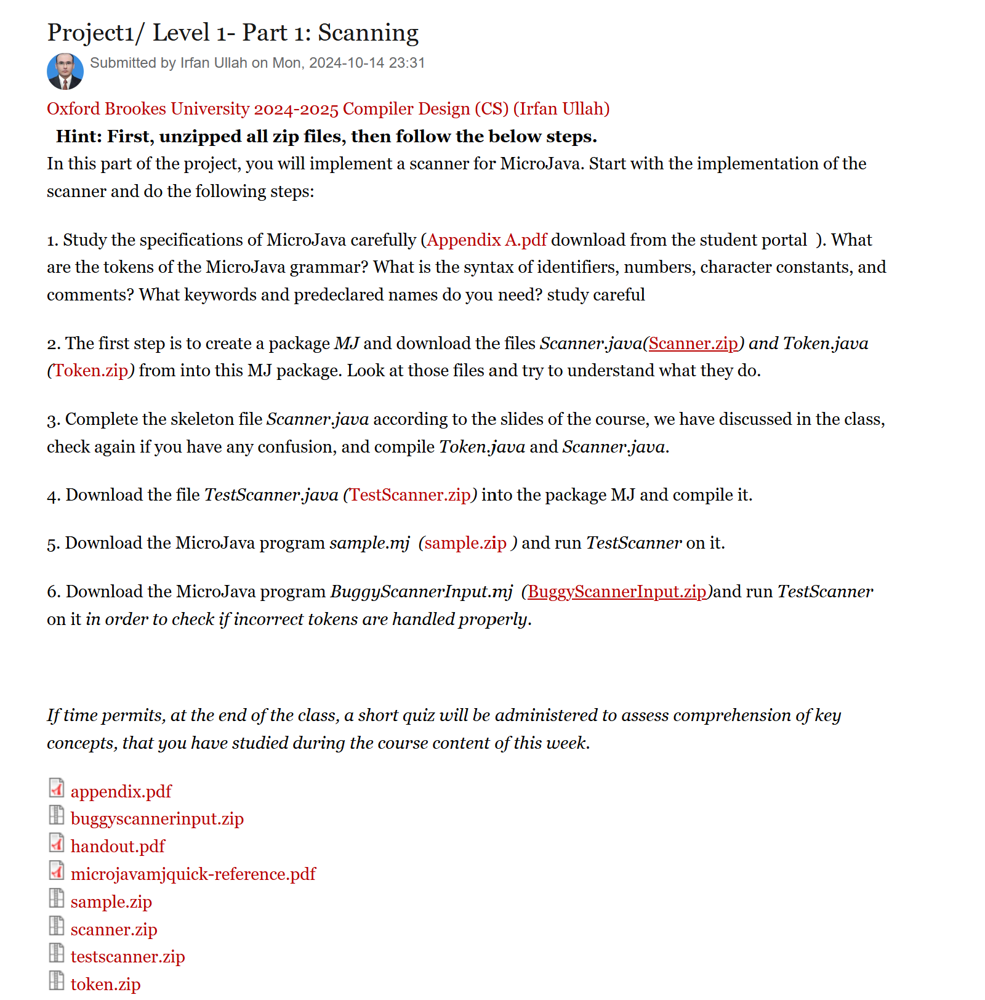
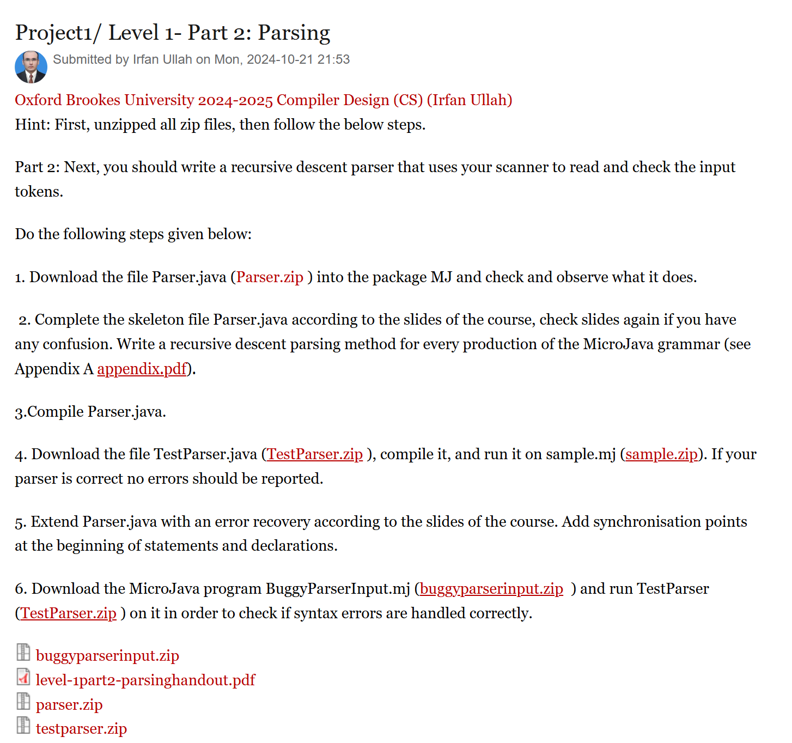
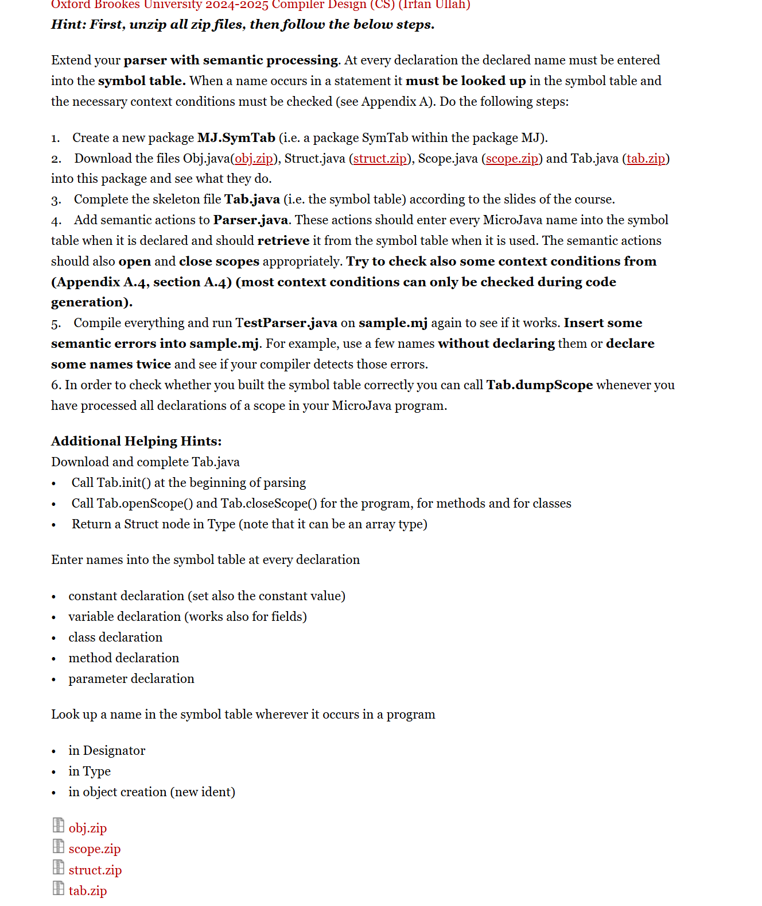
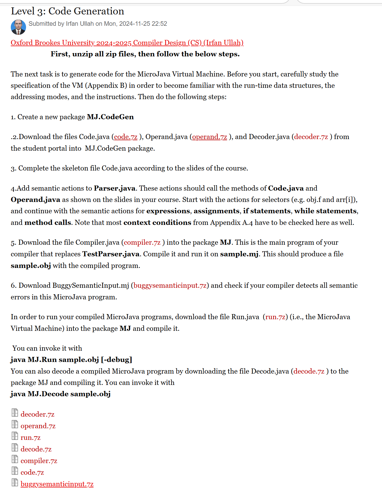
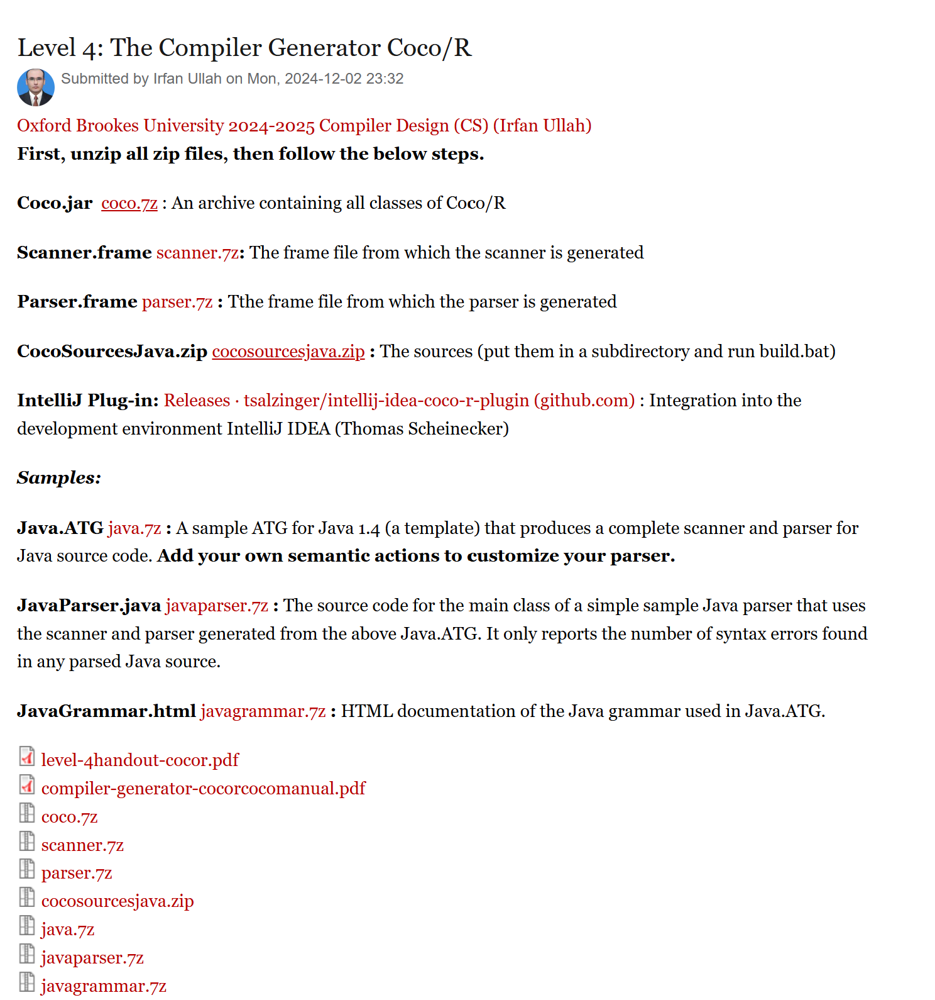

# 牛津布鲁克斯大学(Oxford Brookes University)2024 - 2025年编译器设计课程项目 —— microJava

## 需要辅导请加微信：lambda2024

该文档是牛津布鲁克斯大学2024 - 2025年编译器设计课程的项目指导文档，主要包含四个部分的任务，分别是扫描、语法分析、语义处理和代码生成，以及使用编译器生成器Coco/R的相关任务。每个部分都详细描述了任务目标、操作步骤、所需文件及相关提示，旨在帮助学生逐步构建一个完整的编译器或处理结构化输入的程序。

## 项目1/第一级 - 第一部分：扫描
### 任务目标
为MicroJava实现一个扫描器。

### 操作步骤
1. 仔细研究MicroJava规范（从学生门户下载附录A.pdf），明确MicroJava语法的标记、标识符、数字、字符常量和注释的语法，以及所需的关键字和预声明名称。
2. 创建项目MJ，从MJ项目中下载Scanner.java（Scanner.zip）和Token.java（Token.zip）文件，理解其作用后，根据课程进度完成Scanner.java文件框架，如有疑问再次检查，然后编译Token.java和Scanner.java。
3. 将TestScanner.java（TestScanner.zip）文件导入项目MJ并编译。
4. 下载MicroJava程序sample.mj（sample.zip），在其上运行TestScanner。
5. 下载MicroJava程序BuggyScannerInput.mj（BuggyScannerInput.zip），在其上运行TestScanner，检查错误标记处理情况。

### 相关文件
- appendix.pdf
- buggyscanerinput.zip
- handout.pdf
- microgjavamjquick-reference.pdf
- sample.zip
- scanner.zip
- testscanner.zip
- token.zip

### 时间安排
如果时间允许，课程结束时将进行简短测验评估本周所学关键概念的理解。

## 项目1/第一级 - 第二部分：语法分析
### 任务目标
编写一个递归下降解析器，使用扫描器读取和检查输入标记。

### 操作步骤
1. 将Parser.java（Parser.zip）文件下载到项目MJ中，检查并观察其功能。
2. 根据课程进度完成Parser.java文件框架，为MicroJava语法的每个产生式编写递归下降解析方法（参考附录A appendix.pdf），如有疑问再次检查幻灯片，然后编译Parser.java。
3. 下载TestParser.java（TestParser.zip）文件，编译后在sample.mj（sample.zip）上运行，若解析器正确则不应报告错误。
4. 根据课程进度扩展Parser.java以实现错误恢复功能，在语句和声明开头添加同步点。
5. 下载MicroJava程序BuggyParserInput.mj（buggyparserinput.zip），在其上运行TestParser（TestParser.zip），检查语法错误处理情况。

### 相关文件
- buggyparserinput.zip
- level-part2-parsinghandout.pdf
- parser.zip
- testparser.zip

## 项目1/第二级：语义处理
### 任务目标
用语义处理扩展解析器，实现符号表功能，检查上下文条件。

### 操作步骤
1. 创建新包MJ.SymTab。
2. 下载Obj.java（obj.zip）、Struct.java（struct.zip）、Scope.java（scope.zip）和Tab.java（tab.zip）文件到该包中，查看其作用。
3. 根据课程进度完成Tab.java（符号表）文件框架。
4. 向Parser.java添加语义动作，在声明名称时将其输入符号表，使用名称时从符号表中检索，同时适当打开和关闭作用域，并检查部分上下文条件（多数在代码生成时检查）。
5. 编译所有内容，在sample.mj上再次运行TestParser.java，插入语义错误检查编译器检测能力，处理完所有声明后可调用Tab.dumpScope检查符号表构建是否正确。

### 相关文件
- obj.zip
- scope.zip
- struct.zip
- tab.zip

### 附加提示
- 下载并完成Tab.java：
    - 解析开始时调用Tab.init()。
    - 为程序、方法和类调用Tab.openScope()和Tab.closeScope()。
    - 返回Type中的Struct节点（注意可能是数组类型）。
- 每次声明时将名称输入符号表：
    - 常量声明（同时设置常量值）。
    - 变量声明（对字段也适用）。
    - 类声明。
    - 方法声明。
    - 参数声明。
- 在程序中每次出现名称时在符号表中查找该名称：
    - 在Designator中。
    - 在Type中。
    - 在对象创建（new ident）中。

## 项目1/第三级：代码生成
### 任务目标
为MicroJava虚拟机生成代码。

### 操作步骤
1. 创建新包MJ.CodeGen。
2. 从学生门户将Code.java（code.zip）、Operand.java（operand.zip）和Decoder.java（decoder.7z）文件下载到MJ.CodeGen包中，根据课程进度完成Code.java文件框架。
3. 向Parser.java添加语义动作，调用Code.java和Operand.java中的方法，从选择器开始，继续处理表达式、赋值、if语句、while语句和方法调用的语义动作，检查附录A.4中的大部分上下文条件。
4. 将Compiler.java（compiler.7z）文件下载到包MJ中，编译并在sample.mj上运行，生成sample.obj文件。
5. 下载BuggySemanticInput.mj（buggysemanticinput.7z），检查编译器对语义错误的检测能力。
6. 为运行MicroJava程序，将Run.java（run.7z）（MicroJava虚拟机）下载到包MJ中编译，使用`java MJ.Run sample.obj [-debug]`命令运行；将Decode.java（decode.7z）下载到包MJ中编译，使用`java MJ.Decode sample.obj`命令解码编译后的MicroJava程序。

### 相关文件
- decoder.7z
- operand.7z
- run.7z
- decode.7z
- compiler.7z
- code.7z
- buggysemanticinput.7z

## 项目1/第四级：编译器生成器Coco/R
### 任务目标
使用编译器生成器Coco/R构建处理结构化输入的程序，包含两个子任务（至少完成一个）。

### 任务1：读取并构建二叉树
1. 用递归的EBNF语法描述二叉树输入，编写Coco/R编译器描述，添加属性和语义动作构建二叉树，编写dump方法打印树。
2. 将Coco.jar、Scanner.frame和Parser.frame文件下载到新目录Tree中，在Tree目录下执行`java -jar Coco.jar Tree.atg`生成Scanner.java和Parser.java文件，编写TreeBuilder.java主程序创建扫描器和解析器并调用解析器。

### 任务2：构建电话簿
1. 用语法描述电话簿文件语法，编写Coco/R编译器描述，读取文件构建内存中的电话簿数据结构，每个条目包含姓氏、名字、电话号码（国家代码、城市代码和类型），编写dump方法打印电话簿。

### 相关文件
- level-4handout-cocor.pdf
- compiler-generator-cocorcocomanual.pdf
- coco.7z
- scanner.7z
- parser.7z
- cocosourcesjava.zip
- java.7z
- javaparser.7z
- javagrammar.7z

### 原文挡

 
 
 
 
